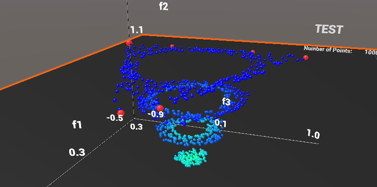
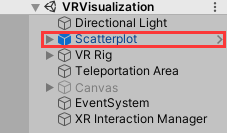
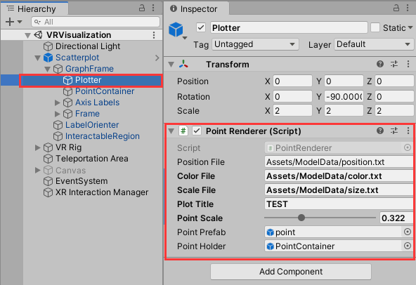
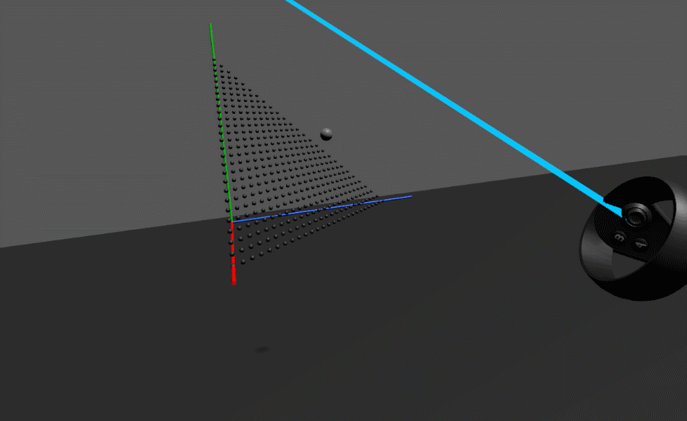
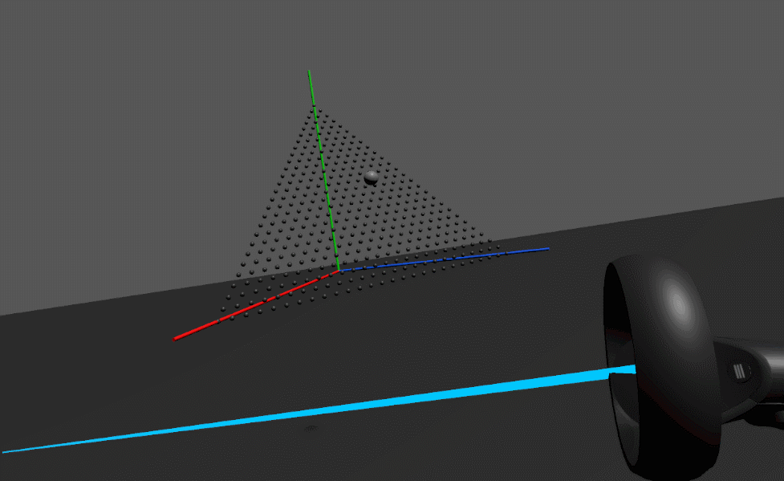

# VRVisualization

VRVisualization is a VR visualization tool for evolutionary algorithm optimization results. The development is based on Unity2019.4.0f1.

## Usage

After opening the project with Unity,  there is sample scene 'VRVisualization' in **'/Scenes'** folder. Go to that scene, the most important object is 'Scatterplot':

It is the visualization prefabs for any 3D data. Open the inspector of 'Plotter' in the sub hierarchy of 'Scatterplot':

Notice the properties exposed by the 'PointRenderer' script. User can the file path to the position file, color file and scale file. Some other properties can also be changed as the function denoted by their names.

As the 'Scatterplot' is a prefab, it can be reused very easily.

## Control

When connect VR to the PC and run the project. Users can use the controllers to control the visualization plot. We provide several useful operations as bellow:

**Distance Control:**

Users can use the rocker of controller to push forward and backward of the plot.

**Rotation Control:**

The rocker can also be pushed left and right to control the rotation of the plot.

**Follow the Hand:**

When the controller ray intersect the plot, users can directly let the plot follow their hand movement.

It is worth noting that the rocker of the left controller can be used to move around the VR world.